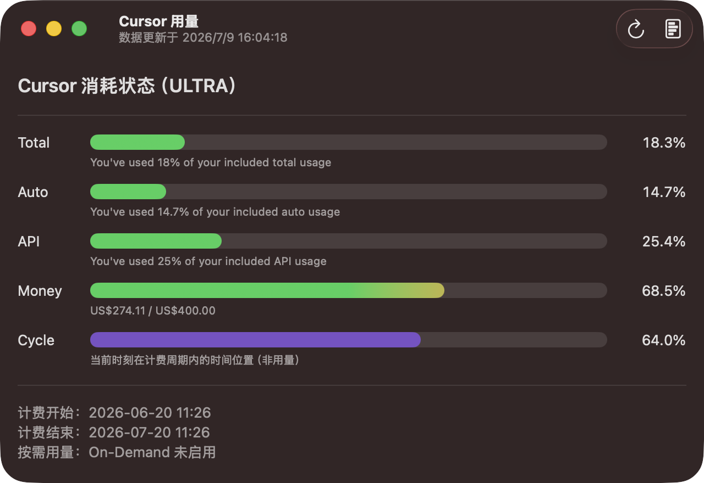
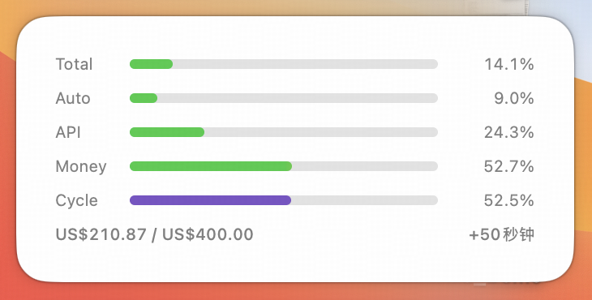

# homebrew-aiusage

**AI Usage** 是一款 macOS 应用，用于实时查看 Cursor 订阅用量，包括 Auto、API、按需额度与计费周期，并支持桌面小组件。

本仓库通过 [Homebrew](https://brew.sh) 分发该应用，作为第三方 Tap 提供安装、升级与卸载。

## 截图

**主应用**



**桌面小组件**



## 环境要求

- 应用要求 macOS **14.6** 或更高
- 已安装 [Homebrew](https://brew.sh)

## 安装

```bash
brew tap 13awan/aiusage
brew install --cask ai-usage
```

## 升级

```bash
brew upgrade --cask ai-usage
```

## 卸载

```bash
brew uninstall --cask ai-usage
```

若不再需要本 Tap，可移除：

```bash
brew untap 13awan/aiusage
```
